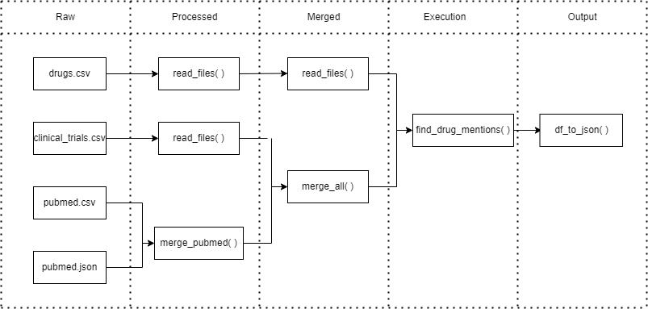

# LittleBigCode - Data Engineer test

## 1. Python and Data Engineering

This project's purpose is the implementation of a data pipeline taking 4 datasets as inputs : a drugs dataset, a pubmed one, and a scientific journal dataset. The data pipeline should output a JSON representing the links between each drug and their respective mentions and dates of mentions in publications.

### Design

A visual representation of the pipeline would be as follows :



Synthesis of the different pipeline steps, that will be broken down into more details further in the present document :

- raw : raw data sources
- processed : wrangling and normalization of the datasets
- merged : data aggreagation/merging
- execution : running a drug search
- output : json final output

### IDE:

PyCharm Community Edition 2022.2.1

### Data pipeline

#### How to run :

Run DataPipeline.py

#### Project layout

This project has been organized as follows :

```
.
├── README.md
├── SQLQueries.sql
├── documentation
│   ├── pipeline_design.png
│   └── tree.xml
└── src
    ├── functions
    │   ├── df_to_json.py
    │   ├── ingestion.py
    │   ├── merging.py
    │   ├── normalization.py
    │   └── search_drugs.py
    ├── main
    │   ├── DataPipeline.py
    │   └── resources
    ├── test
    │   ├── DataPipelineTest.py
    │   └── resources
    └── utils
        └── configs.py
```

##### main/

- resources : Folder that contains both the raw input data and the outputted data 
- DataPipeline.py : Launches the data pipeline
- AdhocProcessing.py : Launches the adhoc processing on the result of the data pipeline 

##### functions/

- df_to_json.py : outputs to a json file
- ingestion.py : Reads input files 
- normalization.py : Normalization of dates
- merging.py :
	- Merges pubmed json and csv data
	- Merges all data entities
- search_drugs.py : 
    - Fetches a list of mentionned drugs 
    - Searches for drug occurences in publication titles and group them with their respective journal and date of mention

##### test/

- DataPipelineTest.py : Unit tests for thedata pipeline, using the unittest package

##### utils/

- configs.py : contains datasets' respective absolute paths

### Ad-Hoc Processing

#### How to run :

Run AdhocProcessing.py

#### Description

This project has been organized as follows : 

```
.
├── README.md
├── SQLQueries.sql
├── documentation
│   ├── pipeline_design.png
│   └── tree.xml
└── src
    ├── functions
    │   ├── adhocquery.py
    │   ├── df_to_json.py
    │   ├── ingestion.py
    │   ├── merging.py
    │   ├── normalization.py
    │   └── search_drugs.py
    ├── main
    │   └── AdhocProcessing.py
    ├── test
    │   ├── AdhocProcessingTest.py
    │   └── resources
    └── utils
        └── configs.py

```

##### main/

- resources/ : Folder that contains both the raw input data and the outputted data
- AdhocProcessing.py : Class that does the adhoc query on the result of the data pipeline

##### functions/

- adhoc_query.py : (in this order)
	- Performs a grouping by 'journal' on the pipeline output, then aggregates it by the count of each drug's respective mentions	
	- Filters the resulting serie with the maximal number of unique occurences of 'drug'
	- Collects the result as a list
	- Prints the result

##### test/

- AdhocProcessingTest.py : Unit tests for the adhoc processing, using the unittest package

### Pipeline improvement ideas

#### More adaptable code

Improving the code's capability to ingest and process more varied file types of differement schemas

#### Error handling

Making the code capable of raising errors, for instance when the raw file formats (when defined) do not match the prerequisites

#### Spark instead of Pandas

Computations distributed across clusters can help us process larger "big data" datasets

## 2. SQL

Open SQLQueries.sql file in project repository
